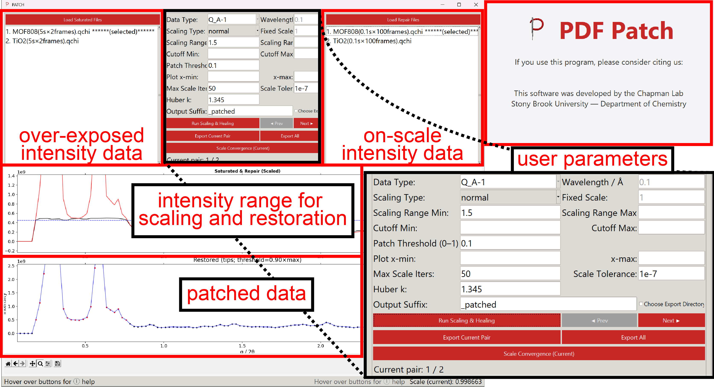

# PATCH PDF Utility

PATCH PDF Utility is a graphical Python application for repairing saturated or overexposed peaks in X-ray total scattering data used for pair distribution function (PDF) analysis. It scales an unsaturated reference dataset to a matched saturated dataset, replaces only the saturated peak-tip regions, and preserves the higher-count statistics from the longer exposure wherever the detector response remains valid.

This repository accompanies the manuscript *Exposure strategies for higher quality PDF analysis: Patching saturated peak intensities* and provides the Python implementation of the PATCH PDF workflow together with example data.



## Keywords

PDF analysis, pair distribution function, X-ray total scattering, total scattering, synchrotron scattering, saturated detector peaks, detector saturation correction, overexposed diffraction data, diffraction data repair, high-Q statistics, Bragg peak saturation, data healing, intensity patching, peak-tip restoration, IRLS scaling, robust scaling, Huber weighting, attenuated scaling, powder diffraction, qchi, chi, iq, gr, scientific Python, Tkinter GUI, Matplotlib, NumPy, Chapman Lab, PATCH PDF Utility.

## What It Does

Quantitative PDF analysis depends on accurate measurement of both intense Bragg reflections and weak diffuse scattering. Short exposures reduce peak saturation but can compromise high-Q signal-to-noise. Long exposures improve weak-scattering statistics but may saturate strong reflections.

PATCH PDF Utility is designed for the common two-exposure strategy:

1. Collect a short, unsaturated reference exposure.
2. Collect a longer exposure with better high-Q statistics.
3. Use the unsaturated exposure to replace only the saturated or near-saturated points in the longer exposure.
4. Export restored files for downstream PDF processing and refinement.

The application keeps the long-exposure data except where the intensity exceeds a user-defined patch threshold. Those peak-tip points are replaced with values from the scaled unsaturated repair dataset.

## Features

- Load matched saturated and repair data files.
- Drag to reorder file pairs and delete selected entries from either list.
- Preview saturated and unscaled repair curves before processing.
- Automatically regrid repair data onto the saturated-data Q grid when needed.
- Scale repair data using robust iteratively reweighted least squares (IRLS).
- Use attenuated scaling with wavelength and x-axis type correction.
- Use a fixed manual scale factor when a known scale is preferred.
- Set scaling range, x-axis cutoff range, plotting range, Huber parameter, iteration limit, and convergence tolerance.
- Patch only the high-intensity peak-tip region above a threshold relative to each saturated file maximum.
- Visualize saturated data, scaled repair data, patch threshold, and restored output.
- Inspect scale convergence for the current file pair.
- Export the current restored pair or all restored pairs.
- Preserve saturated-file headers and delimiters when exporting.

## Supported Data Files

The utility expects two-column numeric scattering files where the first column is the x-axis and the second column is intensity.

Supported extensions and default skipped header lines:

| Extension | Header lines skipped | Typical use |
| --- | ---: | --- |
| `.qchi` | 4 | Integrated Q-chi data |
| `.chi` | 4 | Chi-style scattering data |
| `.iq` | 26 | Intensity vs Q data |
| `.gr` | 26 | PDF-space data |
| `.dat` | 0 | Generic two-column data |
| `.nmf` | 0 | Component data |
| `.pca` | 0 | Component data |

Files may be whitespace-delimited or comma-delimited. Exported files retain the detected delimiter and the header from the saturated dataset.

## Installation

### Requirements

- Python 3.9 or newer recommended
- NumPy
- Matplotlib
- Tkinter

Tkinter is included with many Python installations. On some Linux distributions it must be installed separately, for example with `python3-tk`.

### Set Up From Source

```bash
git clone https://github.com/ChapLab/PATCH-PDF-Utility.git
cd PATCH-PDF-Utility
python -m venv .venv
```

Activate the virtual environment.

Windows PowerShell:

```powershell
.\.venv\Scripts\Activate.ps1
```

macOS or Linux:

```bash
source .venv/bin/activate
```

Install the Python dependencies:

```bash
python -m pip install --upgrade pip
python -m pip install numpy matplotlib
```

## Running The App

From the repository root:

```bash
python src/pdf_patch.py
```

The app opens a Tkinter GUI named `PATCH`. A splash screen appears first, followed by the main processing window.

## Basic Workflow

1. Click **Load Saturated Files** and select the overexposed or saturated datasets.
2. Click **Load Repair Files** and select the matching unsaturated repair datasets.
3. Confirm that the saturated and repair lists have the same number of files.
4. Reorder files by dragging list entries until each saturated file aligns with its repair file.
5. Choose a scaling method: `normal`, `attenuated`, or `fixed`.
6. Set the scaling range and patch threshold.
7. Click **Run Scaling & Healing**.
8. Review the top plot for saturated vs scaled repair data and the bottom plot for restored data.
9. Use **Prev** and **Next** to inspect each pair.
10. Use **Scale Convergence (Current)** to inspect IRLS convergence for the selected pair.
11. Export with **Export Current Pair** or **Export All**.

## Scaling Modes

### Normal

`normal` uses robust IRLS scaling to fit the repair intensity to the nonsaturated portion of the saturated dataset. Points near the saturated peak maximum are excluded from scaling using the patch-threshold rule, and Huber weights reduce the influence of outliers.

### Attenuated

`attenuated` uses the same robust scaling approach with an attenuation correction based on the selected x-axis type and wavelength. Use this mode when the repair exposure was collected through an attenuator and the attenuation correction should depend on scattering angle.

Supported x-axis types:

- `Q_A-1`: Q in inverse Angstroms
- `Q_nm-1`: Q in inverse nanometers
- `two_theta`: two-theta in degrees

### Fixed

`fixed` multiplies the repair dataset by a user-specified constant scale. This is useful when the scale factor is already known from metadata, calibration, or a separate analysis.

## Key Parameters

| Parameter | Meaning |
| --- | --- |
| Data Type | X-axis coordinate type used for attenuated scaling. |
| Wavelength | X-ray wavelength used for attenuated scaling. |
| Scaling Type | `normal`, `attenuated`, or `fixed`. |
| Fixed Scale | Constant multiplier used in fixed scaling mode. |
| Scaling Range Min/Max | X-axis range used to determine the repair-to-saturated scale factor. |
| Cutoff Min/Max | Optional x-axis crop applied before processing. |
| Patch Threshold | Fraction below the saturated maximum used to define replaced peak-tip points. A value of `0.1` patches points at or above 90 percent of the saturated file maximum. |
| Plot x-min/x-max | Display-only plot limits. |
| Max Scale Iters | Maximum IRLS iterations. |
| Scale Tolerance | IRLS convergence tolerance. |
| Huber k | Huber weighting parameter for robust scaling. |
| Output Suffix | Text appended to exported filenames. Default output uses `_patched`. |
| Choose Export Directory | Export to a selected folder instead of the saturated-file directory. |

## Outputs

Exported files are written as two-column text files using the saturated dataset x-axis and restored intensity values. By default, output filenames are based on the saturated input filename plus the output suffix.

Example:

```text
sample.qchi -> sample__patched.qchi
```

If the suffix is changed in the GUI, exported filenames use the new suffix. The app exports either the current selected pair or all processed pairs.

## Example Data

The repository includes example datasets for trying the workflow:

```text
example_data/
  TiO2/
    TiO2(0.1s x 100frames).qchi*
    TiO2(5s x 2frames).qchi*
  MOF-808/
    MOF808(0.1s x 100frames).qchi*
    MOF808(5s x 2frames).qchi*
```

Use the shorter exposure files as repair datasets and the longer exposure files as saturated datasets when exploring the examples.

## Repository Structure

```text
PATCH-PDF-Utility/
  README.md
  LICENSE
  src/
    pdf_patch.py
    patch_logo.ico
    patch_logo.png
  example_data/
    TiO2/
    MOF-808/
  figures/
    gui_screenshot.png
```

## Scientific Notes

PATCH PDF Utility performs a selective replacement, not a global smoothing or denoising operation. The restored output keeps the saturated dataset everywhere except at points above the patch threshold. The quality of the result depends on correct file pairing, a representative unsaturated repair dataset, an appropriate scaling range, and a threshold that captures only the saturated or near-saturated peak region.

For best results:

- Use repair and saturated datasets collected under otherwise comparable experimental conditions.
- Choose a scaling range that contains reliable nonsaturated signal.
- Avoid scaling ranges dominated by saturated peaks, background artifacts, or masked data.
- Inspect the scale convergence plot for unexpected behavior.
- Compare restored output against the original saturated and repair data before using it for downstream refinement.

## Troubleshooting

**The app says file counts differ.**
Load the same number of saturated and repair files, or delete extra entries from the list boxes.

**The wrong files are paired.**
Drag entries in either list until each saturated file lines up with the correct repair file.

**The repair curve does not align with the saturated curve.**
Check the scaling range, scaling mode, wavelength, and x-axis type. If the repair file has a different grid, the app interpolates it onto the saturated grid.

**Exported files are not where expected.**
By default, files are exported to the saturated-file directory. Enable **Choose Export Directory** to select a different output folder.

**Tkinter is missing.**
Install a Python distribution that includes Tkinter, or install the OS package that provides it, such as `python3-tk` on many Linux systems.

## Citation

If you use PATCH PDF Utility in research, please cite the accompanying manuscript:

*Exposure strategies for higher quality PDF analysis: Patching saturated peak intensities*

Update this section with the DOI, journal citation, or preprint link when available.

## License

This project is released under the MIT License. See [LICENSE](LICENSE) for details.

## Authors And Acknowledgments

Developed by the Chapman Lab at Stony Brook University, Department of Chemistry, for practical repair of saturated peak intensities in X-ray total scattering and PDF workflows.
